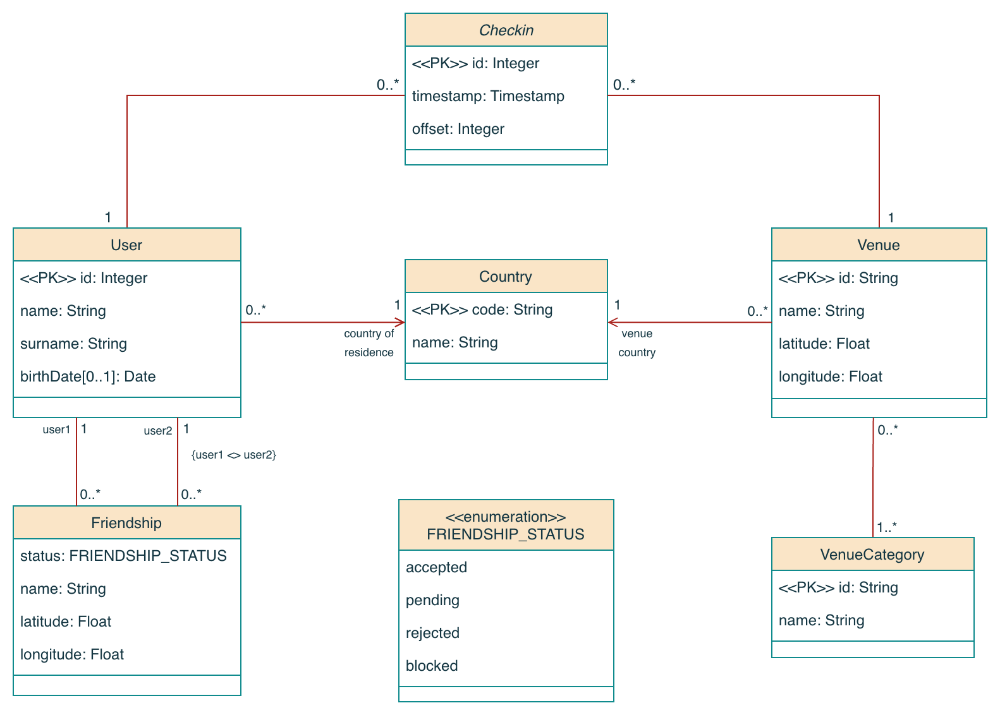
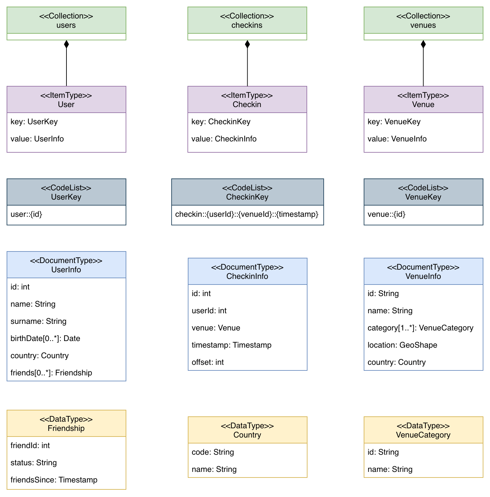

# Foursquare — Couchbase Data Modeling

NoSQL data modeling project for the **Advanced Databases** course.

This project was developed for the Advanced Databases course and focuses on the design and implementation of a NoSQL data model using Couchbase for managing geolocated social network data. The system is based on the public Foursquare Global-scale Check-in Dataset with User Social Networks, which contains anonymized user check-ins, venue information, and friendship relationships collected from the Foursquare platform between April 2012 and January 2014.

The dataset was introduced by Dingqi Yang, Bingqing Qu, Jie Yang, and Philippe Cudré-Mauroux in the paper “Revisiting User Mobility and Social Relationships in LBSNs: A Hypergraph Embedding Approach” (WWW 2019), and later extended in “LBSN2Vec++: Heterogeneous Hypergraph Embedding for Location-Based Social Networks” (TKDE 2020).

The goal of the project is to explore the modeling of complex social and geospatial data in a document-oriented database environment. In particular, the project analyzes how entities such as users, venues, friendships, and check-ins can be represented in Couchbase through document embedding, denormalization, and collection design choices.

---

# Table of Contents

1. [Dataset](#dataset)
2. [Conceptual Model](#conceptual-model)
3. [Physical Model](#physical-model)
4. [Queries and Indexes](#queries-and-indexes)
5. [Project Structure](#project-structure)
6. [Setup and Execution](#setup-and-execution)

---

# Dataset

The project uses the public Foursquare WWW 2013 dataset, composed of:

| File | Description |
|---|---|
| `dataset_WWW_Checkins_anonymized.txt` | User check-ins |
| `raw_POIs.txt` | Venues (Places of Interest) |
| `dataset_WWW_friendship_old.txt` | Friendships before April 2012 |
| `dataset_WWW_friendship_new.txt` | Friendships after April 2012 |

**File formats:**

- **Check-in:** `userId \t venueId \t timestamp \t utcOffset`
- **Venue:** `venueId \t latitude \t longitude \t category \t country`
- **Friendship:** `userId1 \t userId2`

Note that the dataset in this repository is reduced in size, the full version can be retrieved at this [link](https://sites.google.com/site/yangdingqi/home/foursquare-dataset)

---

# Conceptual Model

<p align="center">
  
</p>

---

# Physical Model

<p align="center">
  
</p>

## Data hierarchy

```text
Cluster
 └── Bucket: foursquare
      └── Scope: _default
           ├── Collection: users
           ├── Collection: venues
           └── Collection: checkins
```

---

## Collection `users`

**Document key:** `user::{id}`

The User document embeds the friendship list as an embedded array, avoiding joins when reading user profiles.

```json
{
  "id": 1000006,
  "name": "",
  "surname": "",
  "birthDate": "1987-04-12",
  "country": {
    "code": "US",
    "name": "United States of America"
  },
  "friends": [
    {
      "friendId": 1000010,
      "status": "accepted",
      "friendSince": "2010-03-22"
    },
    {
      "friendId": 1000047,
      "status": "accepted",
      "friendSince": "2013-11-05"
    }
  ]
}
```

---

## Collection `venues`

**Document key:** `venue::{id}`

The geographic position is stored in **GeoJSON Point** format (`[longitude, latitude]`) to support geospatial queries through the Search Service.

```json
{
  "id": "4e468f0a227128e1e8cc133c",
  "name": "4e468f0a227128e1e8cc133c",
  "category": [
    {
      "id": "italianrestaurant",
      "name": "Italian Restaurant"
    }
  ],
  "location": {
    "type": "Point",
    "coordinates": [10.683818, 53.867624]
  },
  "country": {
    "code": "DE",
    "name": "DE"
  }
}
```

---

## Collection `checkins`

**Document key:** `checkin::{userId}::{venueId}::{timestamp}`

The Venue document is **denormalized and embedded** inside the check-in document. This choice avoids expensive joins in the most frequent queries (e.g., Q1), at the cost of higher storage usage.

```json
{
  "id": 42,
  "userId": 1000006,
  "venue": {
    "id": "4e468f0a227128e1e8cc133c",
    "name": "4e468f0a227128e1e8cc133c",
    "category": [
      {
        "id": "italianrestaurant",
        "name": "Italian Restaurant"
      }
    ],
    "location": {
      "type": "Point",
      "coordinates": [10.683818, 53.867624]
    },
    "country": {
      "code": "DE",
      "name": "DE"
    }
  },
  "timestamp": "2012-04-25T21:12:50Z",
  "offset": -420,
  "utcTime": null
}
```

---

# Queries and Indexes

## Query 1 — User check-ins within a date range

Returns all check-ins of a given user within a specified time interval, ordered by date.

```sql
SELECT c.*
FROM `foursquare`.`_default`.`checkins` c
WHERE c.userId = 1000006
  AND c.timestamp >= "2012-05-01T00:00:00Z"
  AND c.timestamp < "2012-06-01T00:00:00Z"
ORDER BY c.timestamp;
```

**Index used:** `idx_checkin_userid_timestamp`

```sql
CREATE INDEX `idx_checkin_userid_timestamp`
ON `foursquare`.`_default`.`checkins`(`userId`, `timestamp`)
WITH {"defer_build": true};
```

---

## Query 2 — Popular venues on a specific day

Finds venues visited by more than 200 distinct users on a given day, returning the full venue information.

```sql
SELECT v.*
FROM (
  SELECT c.venue.id AS venueId
  FROM `foursquare`.`_default`.`checkins` c
  WHERE c.timestamp >= "2012-05-19T00:00:00Z"
    AND c.timestamp < "2012-05-20T00:00:00Z"
  GROUP BY c.venue.id
  HAVING COUNT(DISTINCT c.userId) > 200
) AS popular_venues
JOIN `foursquare`.`_default`.`venues` v
  ON KEYS "venue::" || popular_venues.venueId;
```

**Index used:** `idx_checkin_timestamp_venueid_userid`

```sql
CREATE INDEX `idx_checkin_timestamp_venueid_userid`
ON `foursquare`.`_default`.`checkins`(`timestamp`, `venue.id`, `userId`)
WITH {"defer_build": true};
```

---

## Query 3 — Shared visits with a friend

Given a user, finds all venues visited together with a friend: a visit is considered shared if the two check-ins at the same venue occur within less than 10 minutes.

```sql
SELECT c1.*, c2.*
FROM `foursquare`.`_default`.`users` u
USE KEYS "user::1000006"
UNNEST u.friends f
JOIN `foursquare`.`_default`.`checkins` c1 ON c1.userId = u.id
JOIN `foursquare`.`_default`.`checkins` c2 ON c2.userId = f.friendId
WHERE c1.venue.id = c2.venue.id
  AND c2.timestamp >= DATE_ADD_STR(c1.timestamp, -10, "minute")
  AND c2.timestamp <  DATE_ADD_STR(c1.timestamp, 10, "minute");
```

**Indexes used:**

```sql
CREATE INDEX `idx_checkin_userid_timestamp`
ON `foursquare`.`_default`.`checkins`(`userId`, `timestamp`)
WITH {"defer_build": true};

CREATE INDEX `idx_checkin_userid_venueid_timestamp`
ON `foursquare`.`_default`.`checkins`(`userId`, `venue.id`, `timestamp`)
WITH {"defer_build": true};
```

---

## Bonus — Geospatial Query

Searches for venues within a radius of 10 meters from a geographic coordinate, using Couchbase **Search Service** (Full Text Search). Requires creating a Search index on the `location` field of type GeoJSON.

```json
{
  "query": {
    "field": "location",
    "geometry": {
      "shape": {
        "type": "circle",
        "coordinates": [-73.998753, 40.729209],
        "radius": "10m"
      },
      "relation": "within"
    }
  },
  "size": 10,
  "fields": ["name", "category"],
  "from": 0
}
```

---

## Index summary

| Index name | Fields | Query |
|---|---|---|
| `idx_checkin_userid_timestamp` | `userId`, `timestamp` | Q1, Q3 |
| `idx_checkin_timestamp_venueid_userid` | `timestamp`, `venue.id`, `userId` | Q2 |
| `idx_checkin_userid_venueid_timestamp` | `userId`, `venue.id`, `timestamp` | Q3 |
| Search index on `location` | `location` (GeoJSON) | Bonus |

All secondary indexes are created with `defer_build: true` and then built in batch through `BUILD INDEX`, in order to optimize initialization times.

---

# Project Structure

```text
foursquare-couchbase-project/
├── main.py                        # Entry point: runs db_init and run_queries
├── Dockerfile
├── docker-compose.yml
├── requirements.txt
└── app/
    ├── config/
    │   ├── config.py              # Configuration (host, bucket, collections)
    │   └── logging_config.py      # Logging setup
    ├── data/
    │   ├── dataset_WWW_Checkins_anonymized.txt
    │   ├── dataset_WWW_friendship_new.txt
    │   ├── dataset_WWW_friendship_old.txt
    │   └── raw_POIs.txt
    ├── db/
    │   ├── index_manager.py       # Creation and build of GSI indexes
    │   └── query_manager.py       # Execution of queries Q1, Q2, Q3
    ├── domain/
    │   └── models.py              # Pydantic models (User, Venue, Checkin, ...)
    ├── repositories/
    │   ├── checkin_repository.py  # Check-in data access and manipulation
    │   ├── user_repository.py     # User data access and manipulation
    │   └── venue_repository.py    # Venue data access and manipulation
    ├── scripts/
    │   ├── db_init.py             # Dataset parsing and DB population
    │   └── run_queries.py         # Query execution and timing
    └── services/
        └── db_service.py          # Cluster connection and query execution
```

---

# Setup and Execution

## Prerequisites

- Docker and Docker Compose
- Clone the repository and then download the full dataset from this [link](https://sites.google.com/site/yangdingqi/home/foursquare-dataset)

## Start with Docker Compose

```bash
docker compose up --build
```

This command:

1. Starts a **Couchbase Community** container (port `8091` for the Web UI, `11210` for the SDK)
2. Waits until Couchbase becomes healthy
3. Starts the Python application container, which:
   - Creates the `foursquare` bucket and the `users`, `venues`, and `checkins` collections
   - Reads and imports the dataset (venues → check-ins → friendships)
   - Creates and builds the GSI indexes
   - Executes queries Q1, Q2, Q3 while printing execution times

## Configuration

The main variables are located in `app/config/config.py`:

| Variable | Default | Description |
|---|---|---|
| `DB_HOST` | `couchbase://localhost` | this setting is overridden by docker `DB_HOST` |
| `DB_USER` | `administrator` | Couchbase user for connection |
| `DB_PASSWORD` | `administrator` | Couchbase password for connection |
| `DB_BUCKET` | `foursquare` | Bucket name |
| `DB_BUCKET_RAM_QUOTA_MB` | `1024` | Bucket RAM quota (MB) |

## Accessing the Couchbase UI

Once started, the web console is available at:

```text
http://localhost:8091
```

Credentials: `administrator` / `administrator`

## Python Dependencies

```text
couchbase==4.6.0
pydantic==2.13.3
rich==15.0.0
tqdm==4.67.3
```